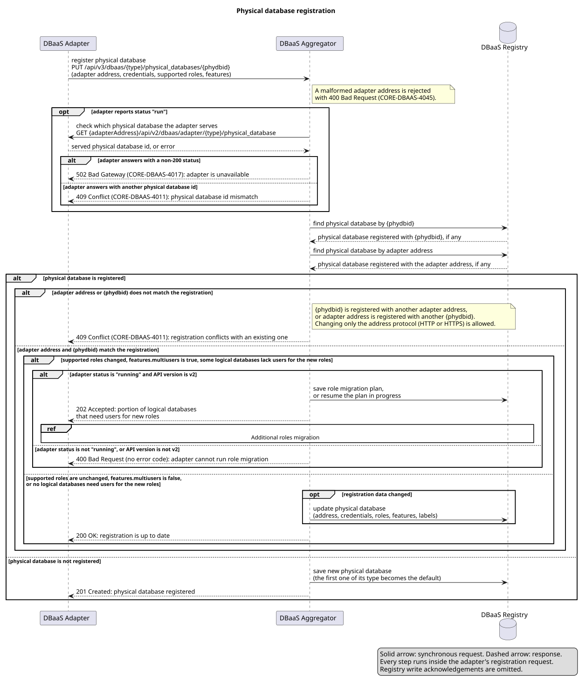
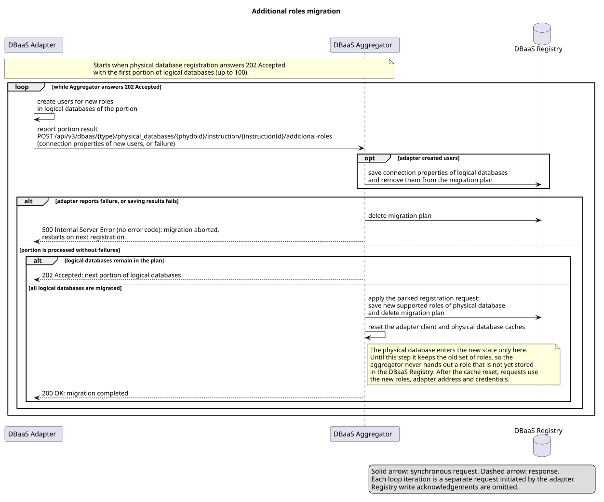

# Declarative Physical Database Registration Design (Draft)

## Current Physical database registration flow

**`PUT /api/v3/dbaas/{type}/physical_databases/{phydbid}`**

`{type}` is the database engine name (e.g., `postgresql`, `mongodb`).
`{phydbid}` is the adapter-assigned identifier for the physical database cluster.



Source: [`/phdbreg.svg`](diagrams/aggregator-registration.svg)

> Roles migration flow defined [below](#continuation-cycle)


**Request body**

```json
{
  "adapterAddress": "http://my-adapter-service:8080",
  "httpBasicCredentials": {
    "username": "admin",
    "password": "secret"
  },
  "labels": {
    "env": "production"
  },
  "status": "running",
  "metadata": {
    "apiVersion": "v2",
    "apiVersions": {
      "specs": [
        {
          "specRootUrl": "/api",
          "major": 2,
          "minor": 1,
          "supportedMajors": [
            1,
            2
          ]
        }
      ]
    },
    "supportedRoles": [
      "admin",
      "rw",
      "ro"
    ],
    "features": {
      "multiusers": true
    },
    "roHost": "my-database-ro-service"
  }
}
```

| Field                                          | Type                   | Required | Description                                                                                                                                                                                                                                                                                                                                                                                                                                                                     |
|------------------------------------------------|------------------------|----------|---------------------------------------------------------------------------------------------------------------------------------------------------------------------------------------------------------------------------------------------------------------------------------------------------------------------------------------------------------------------------------------------------------------------------------------------------------------------------------|
| `adapterAddress`                               | `string`               | Yes      | HTTP(S) address of the DBaaS adapter. Must include scheme and host. Used by the aggregator for all CRUD operations on logical databases. The field carries no `@NonNull` check, so an absent value and an explicit `null` behave alike: both return 500.                                                                                                                                                                                                                        |
| `httpBasicCredentials.username`                | `string`               | Yes      | Username for Basic Auth from the aggregator to the adapter, not a database credential. An absent `httpBasicCredentials` object returns 500, but `username` itself carries no null check: an absent or `null` value is accepted as valid. It surfaces only when the aggregator calls the adapter, and the handshake then fails with `502`. A request whose `status` is `"running"` skips the handshake, so the value is stored as `null` and the request answers `200` or `201`. |
| `httpBasicCredentials.password`                | `string`               | Yes      | Password for Basic Auth from the aggregator to the adapter. Stored encrypted; `isDbActual` decrypts to compare. Behaves like `username`: an absent or `null` value is accepted as valid and fails on the call to the adapter, with `502`. The exception is a request that writes the record without a handshake, where encryption rejects the null value first and registration answers 500.                                                                                    |
| `labels`                                       | `map<string, string>`  | No       | Arbitrary key-value metadata attached to the physical database (e.g. environment, region).                                                                                                                                                                                                                                                                                                                                                                                      |
| `status`                                       | `string`               | Yes      | Registration phase. `"running"` is the first request after adapter startup: no handshake, role migration allowed. `"run"` is every later periodic request: triggers the handshake, role migration rejected. The value is a plain string with neither an enum nor a pattern behind it, so any third value is accepted silently: it skips the handshake (not `"run"`) and blocks role migration (not `"running"`).                                                                |
| `metadata.apiVersion`                          | `string`               | Yes      | Adapter API version string (e.g. `"v2"`). Role migration requires exactly `"v2"`.                                                                                                                                                                                                                                                                                                                                                                                               |
| `metadata.apiVersions`                         | `object`               | No       | Structured API version descriptor. Optional in the aggregator API, mandatory since adapter contract 2.1. Used by the aggregator to determine feature compatibility.                                                                                                                                                                                                                                                                                                             |
| `metadata.apiVersions.specs`                   | `object[]`             | Yes      | Required when `apiVersions` is present. At least one entry.                                                                                                                                                                                                                                                                                                                                                                                                                     |
| `metadata.apiVersions.specs[].specRootUrl`     | `string`               | Yes      | Root URL prefix for this API spec (e.g. `"/api"`).                                                                                                                                                                                                                                                                                                                                                                                                                              |
| `metadata.apiVersions.specs[].major`           | `integer`              | Yes      | Latest supported major version number.                                                                                                                                                                                                                                                                                                                                                                                                                                          |
| `metadata.apiVersions.specs[].minor`           | `integer`              | Yes      | Latest supported minor version number.                                                                                                                                                                                                                                                                                                                                                                                                                                          |
| `metadata.apiVersions.specs[].supportedMajors` | `integer[]`            | Yes      | List of all major versions the adapter accepts. At least one entry.                                                                                                                                                                                                                                                                                                                                                                                                             |
| `metadata.supportedRoles`                      | `string[]`             | Yes      | Roles the adapter can create for logical databases (e.g. `["admin", "rw", "ro"]`). Compared against the stored value ignoring case and order to detect role changes.                                                                                                                                                                                                                                                                                                            |
| `metadata.features`                            | `map<string, boolean>` | Yes      | Feature flags. `multiusers: true` enables batched role migration when `supportedRoles` changes. The aggregator reads the key only when the reported roles differ from the stored ones, so an absent key returns 500 in that case and goes unnoticed otherwise. It is never treated as `false`. An absent `features` map on a request with unchanged roles overwrites the stored map with `null`.                                                                                |
| `metadata.roHost`                              | `string`               | No       | Read-only host of the database cluster. The aggregator never calls it: it adds the value as `roHost` to the connection properties it returns for logical databases on this physical database, and to the connection properties of their users.                                                                                                                                                                                                                                  |

### Actual realization of `202 Accepted` — roles migration cycle

When an adapter reports a set of `supportedRoles` that differs from the stored one, the logical databases created
earlier have users for the old roles only. The aggregator answers `202 Accepted` and runs a batched migration: it
builds a plan of the logical databases that need users for the new roles, hands the adapter one batch at a time, and
applies the registration request only after the last batch is confirmed.

#### How the migration starts

For an already registered physical database, the `PUT` handler decides in this order:

1. `isRolesDifferent` compares `metadata.supportedRoles` with the stored roles, ignoring case and order. It gets there
   by mutating both lists in place: it lowercases the roles of the request and sorts the stored entity's own
   collection. That lowercasing is what every later write depends on, because `writeChanges` stores the roles exactly
   as the request holds them.
2. `metadata.features.multiusers` must be `true`. With `false` the request takes the `200` path: the new roles are
   stored and no users are created for them.
3. `getLogicalDatabasesForMigration` builds the plan — every logical database of this physical database that lacks
   at least one of the new roles. Databases marked for drop are skipped. An empty plan also takes the `200` path.
4. `status` must be `"running"` and `metadata.apiVersion` must be `"v2"`, otherwise the aggregator answers `400`.
5. `saveInstruction` writes one row into `physical_database_instruction`: the plan, the physical database identifier,
   and the entire incoming registration request. Every `role` value in the connection properties is lowercased first.
6. The response carries the first batch — at most the first 100 entries of the plan
   (`InstructionService.PORTION_SIZE`).

The physical database record is not touched on this path. An `adapterAddress`, credential, or label change shipped in
the same request stays unapplied until the cycle completes.

When a row for this `phydbid` already exists — a previous cycle that did not finish — the aggregator returns the
current batch of that instruction under the same id and keeps the request that was parked earlier. The payload of the
new `PUT` is discarded.

#### Who drives the cycle today

The adapter does, through its own registration loop. `StartRegister` runs unconditionally when the adapter sets up its
routes (`qubership-dbaas-adapter-core`, `pkg/impl/fiber/handlers.go`), and `registerPeriodically` repeats the
registration `PUT` for as long as the adapter lives, with a fixed delay between attempts
(`DBAAS_AGGREGATOR_REGISTRATION_FIXED_DELAY_MS`, 150000 ms by default in the PostgreSQL adapter). When a response
carries additional roles, `performAdditionalRoles` posts batch results until the aggregator stops returning batches.

Two consequences follow. A cycle interrupted by an adapter restart resumes on the next periodic `PUT`, because the
aggregator returns the existing instruction instead of building a new one. And that loop is the only driver: the
aggregator never initiates a batch, and nothing expires an instruction row that no one finishes.

#### Continuation cycle



Source: [`/role-migration.svg`](diagrams/aggregator-adapter-migration.svg)

On each step the adapter posts the results of the previous batch to
`/{phydbid}/instruction/{instructionid}/additional-roles`, with `success[]`, `failure`, or both.

#### Message bodies

The examples follow one PostgreSQL adapter that adds `rw` and `ro` to a physical database whose logical databases have
an `admin` user only.

**`202` in response to the registration `PUT`** — the instruction and its id, wrapped in an `instruction` object:

```json
{
  "instruction": {
    "id": "f7c1a2e4-9b3d-4a51-8c6f-2d0e5b7a1c39",
    "additionalRoles": [
      {
        "id": "3a9e6c11-52b8-4f7d-9c03-7e1f4a8b2d65",
        "dbName": "dbaas_orders_a1b2c3d4",
        "connectionProperties": [
          {
            "name": "dbaas_orders_a1b2c3d4",
            "url": "jdbc:postgresql://pg-patroni.postgres-service:5432/dbaas_orders_a1b2c3d4",
            "host": "pg-patroni.postgres-service",
            "port": 5432,
            "username": "dbaas_orders_admin_a1b2c3d4",
            "encryptedPassword": "<opaque value produced by the configured encryption provider>",
            "role": "admin"
          }
        ],
        "resources": [
          {
            "kind": "database",
            "name": "dbaas_orders_a1b2c3d4"
          },
          {
            "kind": "user",
            "name": "dbaas_orders_admin_a1b2c3d4"
          }
        ]
      }
    ]
  }
}
```

> **Stored form, not plaintext.** The aggregator reads the logical databases for the plan without decrypting them, so
> with encryption enabled the adapter receives `encryptedPassword` instead of `password`. The PostgreSQL adapter reads
> `username` and `role` from these entries and never needs the password.

**A batch result posted to `additional-roles`** — one entry per processed logical database, keyed by the `id` it
arrived with, carrying the users created for the new roles:

```json
{
  "success": [
    {
      "id": "3a9e6c11-52b8-4f7d-9c03-7e1f4a8b2d65",
      "connectionProperties": [
        {
          "name": "dbaas_orders_a1b2c3d4",
          "url": "jdbc:postgresql://pg-patroni.postgres-service:5432/dbaas_orders_a1b2c3d4",
          "host": "pg-patroni.postgres-service",
          "port": 5432,
          "username": "dbaas_orders_rw_a1b2c3d4",
          "password": "<plaintext, encrypted by the aggregator on save>",
          "role": "rw"
        },
        {
          "name": "dbaas_orders_a1b2c3d4",
          "url": "jdbc:postgresql://pg-patroni.postgres-service:5432/dbaas_orders_a1b2c3d4",
          "host": "pg-patroni.postgres-service",
          "port": 5432,
          "username": "dbaas_orders_ro_a1b2c3d4",
          "password": "<plaintext, encrypted by the aggregator on save>",
          "role": "ro"
        }
      ],
      "resources": [
        {
          "kind": "database",
          "name": "dbaas_orders_a1b2c3d4"
        },
        {
          "kind": "user",
          "name": "dbaas_orders_rw_a1b2c3d4"
        },
        {
          "kind": "database",
          "name": "dbaas_orders_a1b2c3d4"
        },
        {
          "kind": "user",
          "name": "dbaas_orders_ro_a1b2c3d4"
        }
      ]
    }
  ]
}
```

The aggregator appends these entries to the logical database instead of replacing what is already stored, so a batch
result carries the new roles only. The adapter builds `resources` by concatenating what its user-creation call returns
for each role, and that call reports the database alongside the user — which is why the database appears once per
created role.

**`202` in response to `additional-roles`** — the next batch as a bare array, with no wrapper and no instruction id:

```json
[
  {
    "id": "8d24f0b7-6c19-4e3a-b5d2-91a7c3e04f68",
    "dbName": "dbaas_billing_e5f6a7b8",
    "connectionProperties": [
      {
        "name": "dbaas_billing_e5f6a7b8",
        "url": "jdbc:postgresql://pg-patroni.postgres-service:5432/dbaas_billing_e5f6a7b8",
        "host": "pg-patroni.postgres-service",
        "port": 5432,
        "username": "dbaas_billing_admin_e5f6a7b8",
        "encryptedPassword": "<opaque value produced by the configured encryption provider>",
        "role": "admin"
      }
    ],
    "resources": [
      {
        "kind": "database",
        "name": "dbaas_billing_e5f6a7b8"
      },
      {
        "kind": "user",
        "name": "dbaas_billing_admin_e5f6a7b8"
      }
    ]
  }
]
```

**A failed batch** — one database id and one message. The aggregator aborts the cycle:

```json
{
  "failure": {
    "id": "8d24f0b7-6c19-4e3a-b5d2-91a7c3e04f68",
    "message": "pq: permission denied to create role"
  }
}
```

The `200` that ends the cycle has an empty body.

## Possible responses and operator behavior

Responses of **`PUT /api/v3/dbaas/{type}/physical_databases/{phydbid}`**

| HTTP Code          | Situation                                                                                                                                                                                                                                                                                                                                                                                                                                                                                                                                                                                                                                                                                                                                                                                | Error code                                                                               | Operator outcome                                                                       |
|--------------------|------------------------------------------------------------------------------------------------------------------------------------------------------------------------------------------------------------------------------------------------------------------------------------------------------------------------------------------------------------------------------------------------------------------------------------------------------------------------------------------------------------------------------------------------------------------------------------------------------------------------------------------------------------------------------------------------------------------------------------------------------------------------------------------|------------------------------------------------------------------------------------------|----------------------------------------------------------------------------------------|
| `200 OK`           | Physical database already registered; roles unchanged. All properties match (`isDbActual=true`) — no update written — or at least one property differs (`isDbActual=false`) — aggregator updates: `adapterAddress`, `httpBasicCredentials.username`, `httpBasicCredentials.password`, `labels`, `metadata.apiVersion`, `metadata.apiVersions`, `metadata.supportedRoles`, `metadata.features`, `metadata.roHost`, plus `phydbid` when the stored record is still `unidentified` (legacy rows only — no current code path sets that flag, and `isDbActual` does not compare it, so the identifier is repaired only when some other property differs as well). A write also resets the cached adapter client and the cached physical database, so rotated credentials take effect at once. | —                                                                                        | `Succeeded` — `Ready=True`, `Stalled=False`, `Reason=AdapterRegistered` (new constant) |
| `200 OK`           | Physical database already registered; roles changed but `multiusers` is explicitly `false` — migration is not triggered. `isDbActual` check applies as above, so `writeChanges` still persists the new `supportedRoles` even though no users are created for them.                                                                                                                                                                                                                                                                                                                                                                                                                                                                                                                       | —                                                                                        | `Succeeded` — `Ready=True`, `Stalled=False`, `Reason=AdapterRegistered` (new constant) |
| `200 OK`           | Physical database already registered; roles changed, `multiusers=true`, but all logical databases already have the required roles (`getLogicalDatabasesForMigration` returns an empty list) — migration is not needed. `isDbActual` check applies as above.                                                                                                                                                                                                                                                                                                                                                                                                                                                                                                                              | —                                                                                        | `Succeeded` — `Ready=True`, `Stalled=False`, `Reason=AdapterRegistered` (new constant) |
| `201 Created`      | Physical database did not exist — neither `phydbid` nor `adapterAddress` is known — registered successfully. `supportedRoles` are lowercased before saving, the password is encrypted, and the first physical database of a given type is flagged `global` automatically. The flag is computed at creation only and never revisited, but deletion guards it: `DELETE` answers `406` while the global physical database still has siblings of its type, so the flag has to be moved with `PUT /{phydbid}/global` first. Only the last physical database of a type can be deleted while global. `Location` points at the new resource.                                                                                                                                                     | —                                                                                        | `Succeeded` — `Ready=True`, `Stalled=False`, `Reason=AdapterRegistered` (new constant) |
| `202 Accepted`     | Physical database exists, roles differ, `multiusers=true`, at least one logical database needs new roles, `status="running"` and `apiVersion="v2"`. Nothing is written to the physical database record on this path: the request is parked in `physical_database_instruction.physical_db_reg_request` and applied only when the cycle completes.                                                                                                                                                                                                                                                                                                                                                                                                                                         | —                                                                                        | `WaitingForDependency` — `Ready=False`, `Stalled=False`, `Reason=RoleMigrationStarted` |
| `400 Bad Request`  | Request body cannot be deserialized: invalid JSON, wrong field type, or a required field (`metadata`, `status`, `apiVersion`, `supportedRoles`, `features`) is explicitly `null`. An **absent** required field is not caught here — see the 500 rows.                                                                                                                                                                                                                                                                                                                                                                                                                                                                                                                                    | No error code — plain string: `"Not able to deserialize data provided."`                 | `InvalidConfiguration` — `Ready=False`, `Stalled=True`, `Reason=AggregatorRejected`    |
| `400 Bad Request`  | `adapterAddress` is malformed: `host` or `scheme` is missing (e.g. `"localhost:8080"`, `"http://"`).                                                                                                                                                                                                                                                                                                                                                                                                                                                                                                                                                                                                                                                                                     | `CORE-DBAAS-4045` — Adapter address name has wrong format                                | `InvalidConfiguration` — `Ready=False`, `Stalled=True`, `Reason=AggregatorRejected`    |
| `400 Bad Request`  | Roles migration is required (`multiusers=true`, roles changed, logical databases exist) but `status != "running"` or `apiVersion != "v2"`. Unreachable for the operator, which always sends `status="running"` and `apiVersion="v2"` — those requests get `202` instead.                                                                                                                                                                                                                                                                                                                                                                                                                                                                                                                 | No error code — plain string: `"Adapter status run or adapter version is not equals v2"` | `InvalidConfiguration` — `Ready=False`, `Stalled=True`, `Reason=AggregatorRejected`    |
| `400 Bad Request`  | JSON serialization fails while saving or reading the instruction context in the database (corrupted instruction data). A server-side failure reported as a client error: the operator stalls on a request a retry would have fixed.                                                                                                                                                                                                                                                                                                                                                                                                                                                                                                                                                      | No error code — plain string: `"Not able to deserialize data provided."`                 | `InvalidConfiguration` — `Ready=False`, `Stalled=True`, `Reason=AggregatorRejected`    |
| `401 Unauthorized` | No credentials provided or invalid authentication token. Returned by Quarkus Security before the method is invoked.                                                                                                                                                                                                                                                                                                                                                                                                                                                                                                                                                                                                                                                                      | No error code — Quarkus Security framework response                                      | `BackingOff` — `Ready=False`, `Stalled=False`, `Reason=Unauthorized`                   |
| `403 Forbidden`    | Authenticated principal does not have the `DB_CLIENT` role (`@RolesAllowed(DB_CLIENT)` on the controller class). Returned by Quarkus Security before the method is invoked.                                                                                                                                                                                                                                                                                                                                                                                                                                                                                                                                                                                                              | No error code — Quarkus Security framework response                                      | `InvalidConfiguration` — `Ready=False`, `Stalled=True`, `Reason=AggregatorRejected`    |
| `409 Conflict`     | **`phydbid` address mismatch**: the requested `phydbid` is already registered with a different `adapterAddress`, and the change is not a scheme change on the same host. `isTLSUpdate` accepts any scheme change, including an `https`→`http` downgrade, and ignores the port, so a port change under the same scheme conflicts.                                                                                                                                                                                                                                                                                                                                                                                                                                                         | `CORE-DBAAS-4011` — Invalid physical identifier                                          | `InvalidConfiguration` — `Ready=False`, `Stalled=True`, `Reason=AggregatorRejected`    |
| `409 Conflict`     | **Adapter bound to a different `phydbid`**: the requested `adapterAddress` is already registered under a different `phydbid` marked as `identified`. Evaluated only when the address-mismatch check above does not fire — the two are an `if`/`else if` pair, not independent checks.                                                                                                                                                                                                                                                                                                                                                                                                                                                                                                    | `CORE-DBAAS-4011` — Invalid physical identifier                                          | `InvalidConfiguration` — `Ready=False`, `Stalled=True`, `Reason=AggregatorRejected`    |
| `409 Conflict`     | **Handshake identity mismatch**: the adapter answers the handshake with an `id` that differs from the requested `phydbid`. Reachable only when `status` is `"run"`.                                                                                                                                                                                                                                                                                                                                                                                                                                                                                                                                                                                                                      | `CORE-DBAAS-4011` — Invalid physical identifier                                          | `InvalidConfiguration` — `Ready=False`, `Stalled=True`, `Reason=AggregatorRejected`    |
| `500 Server Error` | `features` has no `multiusers` key **and** the reported roles differ from the stored ones. The aggregator unboxes `features.get("multiusers")` into a `boolean` behind a short-circuiting `&&`, so a missing key raises a `NullPointerException` on that branch only and passes unnoticed when the roles match. Not in the OpenAPI contract.                                                                                                                                                                                                                                                                                                                                                                                                                                             | `CORE-DBAAS-2000` — Unexpected exception                                                 | `BackingOff` — `Ready=False`, `Stalled=False`, `Reason=AggregatorError`                |
| `500 Server Error` | A required field is **absent** rather than `null`, or `adapterAddress` or `httpBasicCredentials` is absent or explicitly `null` — neither of those two carries a `@NonNull` check, so for them the two cases behave alike. All fail on an unguarded dereference. Not in the OpenAPI contract.                                                                                                                                                                                                                                                                                                                                                                                                                                                                                            | `CORE-DBAAS-2000` — Unexpected exception                                                 | `BackingOff` — `Ready=False`, `Stalled=False`, `Reason=AggregatorError`                |
| `502 Bad Gateway`  | The adapter **answered** the handshake with a non-200 status. A transport-level failure is a 500, not a 502. Triggered only when `status` is `"run"`.                                                                                                                                                                                                                                                                                                                                                                                                                                                                                                                                                                                                                                    | `CORE-DBAAS-4017` — Request to adapter failed                                            | `BackingOff` — `Ready=False`, `Stalled=False`, `Reason=AggregatorError`                |

Responses of **/{phydbid}/instruction/{instructionid}/additional-roles**

| HTTP Code          | Situation                                                                                                                                                                                                                                                                             | Error code                                                                                                                                                                 |
|--------------------|---------------------------------------------------------------------------------------------------------------------------------------------------------------------------------------------------------------------------------------------------------------------------------------|----------------------------------------------------------------------------------------------------------------------------------------------------------------------------|
| `200 OK`           | Migration completed. Connection properties saved, the parked registration request applied to the physical database record, instruction row deleted                                                                                                                                    | —                                                                                                                                                                          |
| `202 Accepted`     | Body carries the next batch. Connection properties and resources of the reported databases; those ids are removed from the plan                                                                                                                                                       | —                                                                                                                                                                          |
| `400 Bad Request`  | Request body cannot be deserialized, or the stored instruction `context` cannot be read. `JsonProcessingExceptionMapper` maps every `JsonProcessingException` to `400`, and the reads outside the `success` block — `findInstructionById`, `findNextAdditionalRoles` — are not caught | No error code — plain string: `"Not able to deserialize data provided."`                                                                                                   |
| `401 Unauthorized` | No credentials provided or invalid authentication token. Returned by Quarkus Security before the method is invoked                                                                                                                                                                    | No error code — Quarkus Security framework response                                                                                                                        |
| `403 Forbidden`    | Authenticated principal does not have the `DB_CLIENT` role (`@RolesAllowed(DB_CLIENT)` on the controller class)                                                                                                                                                                       | No error code — Quarkus Security framework response                                                                                                                        |
| `404 Not Found`    | Plain message `Instruction with Id = <id> not found`.                                                                                                                                                                                                                                 | No error code — plain string                                                                                                                                               |
| `500 Server Error` | Cycle aborted. Instruction row deleted together with the parked request. Connection properties saved earlier in the same request are kept                                                                                                                                             | No error code — plain string: `"An error has occurred:<message>"` on a reported `failure`, `"An error occurred during the migration procedure: <message>"` on a save error |

> **Absent versus `null`.** Lombok generates the `@NonNull` check inside the setter, and Jackson calls the setter only
> when the key is present. `"metadata": null` therefore fails deserialization and returns 400, while omitting the
> `metadata` key leaves the field `null` and fails later with 500. The rule covers exactly the five annotated fields:
> `metadata`, `status`, `apiVersion`, `supportedRoles`, and `features`. `adapterAddress` and `httpBasicCredentials`
> carry no annotation, so an explicit `null` there is not caught either and ends in the same 500 as an absent key.

**Order of the checks.** The handler validates the `adapterAddress` format first, before it reaches either the adapter
or the database, so a malformed address outranks every later failure: an unreachable adapter behind a malformed address
still answers `400`, not `502`. The handshake comes next, and only when `status` is `"run"`. The identifier and address
conflicts follow, then the role comparison and the `multiusers` gate, and the `isDbActual` comparison runs last.

#### Implementation notes

**Nothing reaches the physical database record until the cycle completes.** `writeChanges` is skipped on the `202`
path. `completeMigrationProcedure` → `savePhysicalDatabaseWithRoles` applies the payload of the `PUT` that created the
instruction, not the payload of the `PUT` that happened to finish the cycle. That call is `writeChanges` without the
`isDbActual` comparison the `200` path performs, so completion always writes.

**An aborted cycle keeps the work already done.** Both endpoints are `@Transactional`, and the `500` paths of the
continuation endpoint return a `Response` instead of throwing, so the transaction commits anyway: connection properties
reported in `success[]` are saved before the failure is handled, in the same transaction that deletes the instruction.
The next cycle skips the databases that already have every role, so it covers fewer databases than the one before it.

**Response shapes differ between the two endpoints.** `PUT` returns an object wrapping the instruction and its `id`,
while `POST .../additional-roles` returns a bare array of `AdditionalRoles`. Whoever drives the cycle has to carry the
instruction id itself.

**The branch that recreates an instruction never runs.** `findPortion` returns `null` once a plan is empty, and the
`PUT` handler then deletes the row and builds a new instruction from the current plan. That state is never committed:
the last `POST .../additional-roles` empties the plan and deletes the row in one transaction.

## Suggested PhysicalDatabase behaviour


Source: [declarative-registration.svg](diagrams/declarative-registration.svg)

## Suggested PhysicalDatabase CR

`PhysicalDatabase` declares a physical database (a DBMS cluster plus its dbaas adapter) that
dbaas-aggregator should know about. The operator does **not** install the adapter or the DBMS — both must already be
running.

> **Registration outlives the CR** - deleting the CR stops managing the registration but does not remove it, because a
> physical database carries logical databases.

> **Self-registration cannot always be switched off.** While the adapter keeps registering, it and the operator both
> `PUT` their own view of the same row, each write makes the other's `isDbActual` comparison fail, and the row churns
> on every cycle with an adapter-cache reset each time.

### PhysicalDatabase Resource Fields

```yaml
# The adapter's own Basic Auth credentials; must be in the same namespace as the CR
apiVersion: v1
kind: Secret
metadata:
  name: dbaas-adapter-credentials
  namespace: dbaas-db-adapters
type: Opaque
stringData:
  username: "dbaas-aggregator"
  password: "<adapter-password>"
---
apiVersion: dbaas.netcracker.com/v1
kind: PhysicalDatabase
metadata:
  name: postgres-core
  namespace: dbaas-db-adapters
spec:
  operatorNamespace: dbaas-system
  adapterAddress: http://pg-dbaas-adapter.postgres:8080   # required; a scheme and a host
  credentialsSecretRef: # required; the ADAPTER's own Basic Auth pair
    name: dbaas-adapter-credentials    # required; Secret in the CR's namespace
```

> **`observedGeneration` is the field used to determine whether the current
> specification has reached a terminal reconciliation state.**
>
> The Operator updates `status.observedGeneration` only when reconciliation
> reaches a terminal state for the current `metadata.generation`:
> `Ready=True` or `Stalled=True`.


> **Force an immediate refresh**: when a referenced Secret changes and the CR and Secret have independent
> lifecycles, updating the dbaas.netcracker.com/refresh annotation on the CR forces the controller to
> reconcile the CR immediately instead of waiting for the next periodic resync. The controller re-reads the
> Secret and re-registers the physical database with dbaas-aggregator.

```bash
kubectl annotate physicaldatabase <name> dbaas.netcracker.com/refresh="$(date +%s)" --overwrite
```

**Top-level spec fields:**

| Field                            | Required | Mutable | Description                                                                                                                                                                                                                                                                                                                                                                                                                                                                                                                             |
|----------------------------------|:--------:|:-------:|-----------------------------------------------------------------------------------------------------------------------------------------------------------------------------------------------------------------------------------------------------------------------------------------------------------------------------------------------------------------------------------------------------------------------------------------------------------------------------------------------------------------------------------------|
| `spec.operatorNamespace`         |   Yes    | **No**  | Which operator instance owns the CR; must equal that operator's `CLOUD_NAMESPACE`. Same rule as the seven CRs that already carry this field: an RFC-1123 label within `maxLength: 63`, immutable after creation.                                                                                                                                                                                                                                                                                                                        |
| `spec.adapterAddress`            |   Yes    |   Yes   | Adapter base URL, sent as `adapterAddress`. Must match `^[^\s:/?#]+://[^\s/?#]+`: a scheme token, `://`, and a non-empty host. Scheme validity is not checked here. Changes when the adapter switches to TLS mode: the scheme becomes `https`, and the port may change with it. Left mutable on purpose: the aggregator accepts a change only when the host is unchanged and the scheme differs, so `http://a:8080` to `https://a:8443` passes while a port-only change gets `409`. A rejected change surfaces as `AggregatorRejected`. |
| `spec.credentialsSecretRef`      |   Yes    |   Yes   | Reference to the Secret holding the **adapter's own** Basic Auth credentials, sent as `httpBasicCredentials`. Operator is hardcoded to watch `username` and `password` names.                                                                                                                                                                                                                                                                                                                                                           |
| `spec.credentialsSecretRef.name` |   Yes    |   Yes   | Secret name. The Secret must be in the CR's namespace.                                                                                                                                                                                                                                                                                                                                                                                                                                                                                  |

> **Two different credential sets.** `spec.credentialsSecretRef` holds the credentials **dbaas-aggregator
> uses to call the adapter**. The operator's own credentials for calling the aggregator are unrelated: they come from
> `users.json` in the mounted `dbaas-security-configuration-secret`, or from an M2M token when
> `KUBERNETES_M2M_ENABLED=true`. Neither is an environment variable.

### Pre-flight Checks

The operator stops a spec before the `PUT` when the aggregator would reject it, or would accept it and fail later.
Checks run in three layers, cheapest first: the API server validates the schema at admission, the controller checks
the spec against other CRs and the Secret, and the controller probes the adapter.

**Schema and CEL rules (admission):**

| Field                    | Rule                                                                                      | Aggregator behavior without the rule                                                                                                                                                                                         |
|--------------------------|-------------------------------------------------------------------------------------------|------------------------------------------------------------------------------------------------------------------------------------------------------------------------------------------------------------------------------|
| `spec.operatorNamespace` | `minLength: 1`, `maxLength: 63`, `^[a-z0-9]([-a-z0-9]*[a-z0-9])?$`, CEL `self == oldSelf` | A value that cannot name a namespace never matches any operator's `CLOUD_NAMESPACE`, so no operator instance claims the CR and it sits with no status and no event. Copied from the seven CRs that already carry this field. |
| `spec.adapterAddress`    | `^[^\s:/?#]+://[^\s/?#]+`                                                                 | `validateRequest` rejects an address whose `URI.getHost()` or `URI.getScheme()` is null with `400 CORE-DBAAS-4045`.                                                                                                          |

**Controller checks (no network):**

| Check                                                                    | Operator outcome                                                                      |
|--------------------------------------------------------------------------|---------------------------------------------------------------------------------------|
| Another CR claims the same `physicalDatabaseId`                          | `InvalidConfiguration` — `Ready=False`, `Stalled=True`, `Reason=RegistrationConflict` |
| Another CR claims the same `adapterAddress`                              | `InvalidConfiguration` — `Ready=False`, `Stalled=True`, `Reason=RegistrationConflict` |
| The Secret is absent, a key is missing or empty, or RBAC denies the read | `BackingOff` — `Ready=False`, `Stalled=False`, `Reason=SecretError`                   |

The older claimant wins a conflict, by `creationTimestamp` and then by UID. The aggregator keys a registration by
`physicalDatabaseId` alone, so two CRs with the same identifier and different types would overwrite one row. Addresses
are compared as exact strings, as the aggregator compares them.

### How PhysicalDatabase Works

A reconcile is triggered when any of the following happens:

- The CR is created.
- The CR spec changes (`metadata.generation` increments).
- The `dbaas.netcracker.com/refresh` annotation changes (manual re-sync).
- Another `PhysicalDatabase` claiming the same `physicalDatabaseId` or the same `adapterAddress` is
  created, deleted, or changed (sibling-conflict recovery).
- A periodic re-sync: every successful reconcile re-enqueues itself after
  `DBAAS_PHYSICAL_DATABASE_RESYNC_INTERVAL`, a Go duration such as `30m` or `1h` set via the Helm value
  of the same name. Empty uses the built-in default (`10m`); a value that is unparseable or not positive is logged and
  ignored, and the default applies. The operator does not watch Secrets, so the re-sync is what picks up a rotated
  adapter password, and its `PUT` also restores a row changed outside the CR. A longer interval suits adapters whose
  passwords rarely change, at the cost of a longer window of `401` errors after a rotation.

```text
CR created (CRD schema and CEL rules passed at admission)
        │
        ▼
  Operator assignment check (`spec.operatorNamespace`)
        │ assigned elsewhere → skip, write no status
        ▼
  phase = Processing
        │
        ▼
  Pre-flight validation
    another CR claims the same adapterAddress? ────▶ InvalidConfiguration (RegistrationConflict)
        │
        ▼
  Read the adapter credentials Secret
    Secret absent / key missing / RBAC denied ──────▶ BackingOff (SecretError)
        │
        ▼
  Probe the adapter: GET {address}/api/v2/physical_database
  → response: physicalDatabaseId, type, supportedRoles, features, labels, roHost, apiVersions
    401 / 403 ──────────────────────────────────────▶ BackingOff (Unauthorized)
    500+ ───────────────────────────────────────────▶ BackingOff (AdapterError)
        │
        ▼
  Pre-flight validation
    another CR claims the same physicalDatabaseId? ─▶ InvalidConfiguration (RegistrationConflict)
        │
        ▼
  PUT /api/v3/dbaas/{type}/physical_databases/{phydbid}?internalMigration=true
    401 ────────────────────────────────────────────▶ BackingOff (Unauthorized)
    400 / 403 / 409 ────────────────────────────────▶ InvalidConfiguration (AggregatorRejected)
    5xx / network ──────────────────────────────────▶ BackingOff (AggregatorError)
        │
        ├── 200 OK / 201 Created
        │        │
        │        ▼
        │   Succeeded — Ready=True / PhysicalDatabaseRegistered
        │
        └── 202 Accepted — role migration in process
                 │
                 ▼
            WaitingForDependency — Ready=False, Stalled=False / RoleMigrationStarted
```

#### Adapter information endpoint

> **Placeholder — adapter implementation pending.** The `GET /api/v2/physical_database` step in the flow above is
> illustrative. It represents the endpoint a v2-capable adapter exposes to report its physical database descriptor,
> letting the operator forward that data to the aggregator without requiring those fields in the CR. New endpoint on operator side not implemented yet.
>
> When implemented, the response must include every field the aggregator's registration request body accepts - [PhysicalDatabaseRegistryRequestV3](../../../../../dbaas/dbaas-aggregator/src/main/java/com/netcracker/cloud/dbaas/dto/v3/PhysicalDatabaseRegistryRequestV3.java)

#### `internalMigration` query parameter

The aggregator registration endpoint (`PUT /api/v3/dbaas/{type}/physical_databases/{phydbid}`) is an existing endpoint.
The operator adds the optional `internalMigration=true` query parameter to signal that the aggregator should drive role
migration internally — calling the adapter for new users directly — instead of delegating batches back to the adapter
via `202 Accepted`.

> **Aggregator-side internal migration is not yet implemented.** The `internalMigration` parameter will be optional and the self-driven migration path is pending implementation on the aggregator side.