# Backup & Restore V2

## Table of Contents

- [Requirements](#requirements)
- [Overview](#overview)
  - [Backup API](#backup-api)
  - [Restore API](#restore-api)
  - [Dry Run](#dry-run)
- [High Level e2e Backup & Restore Process](#high-level-e2e-backup--restore-process)
- [Open API](#open-api)
- [Data Model](#data-model)
  - [Backup V2 Data Model](#backup-v2-data-model)
  - [Restore V2 Data Model](#restore-v2-data-model)
- [Sequence Diagrams](#sequence-diagrams)
  - [Start Backup](#start-backup)
  - [Check Backup Async](#check-backup-async)
  - [Start Restore](#start-restore)
  - [Check Restore Async](#check-restore-async)
  - [Retry Restore](#retry-restore)
  - [Get Backup Metadata](#get-backup-metadata)
  - [Upload Backup Metadata](#upload-backup-metadata)
  - [Delete Backup](#delete-backup)
- [State Diagrams](#state-diagrams)
  - [Backup](#backup)
  - [Restore](#restore)
- [Configuration Parameters](#configuration-parameters)

> ⚠️ **Warning**
> Backup & Restore V2 is available in DBaaS starting from version 26.1.
>
> Backup and restore are supported for any external database engine, provided that the corresponding DBaaS Adapter and Backup Daemon implement the common backup/restore endpoints required by DBaaS.
>
> The Backup Daemon must also be configured with access to an S3-compatible object storage, which is used to store backup binary data (payloads).

## Requirements

- Flexible Backup scope
  - Backup namespace
  - Backup several microservices
- Flexible Restore scope (to another namespace and/or tenant):
  - Restore full backup
  - Restore part of backup
- Backup/Restore portability
  - Capability to restore backup in another DBaaS

## Overview

Backup & Restore V2 provides flexible control over which databases are backed up and restored.

DBaaS acts as a registry of logical databases. Each logical database is identified by one or more classifiers.

A classifier is a sorted map of key-value pairs. Common keys include:

- `namespace`
- `microserviceName`
- `scope`
- `tenantId` (when applicable)

`databaseType` and `databaseKind` are filter fields used in Backup/Restore requests, not classifier keys stored as-is.

### Backup API

Backup & Restore V2 supports flexible database filtering and backs up databases that match include/exclude criteria.

As a result, a `Backup` entity is created in DBaaS. It includes:

- Parameters used to create the backup
- Adapter-level and database-level backup state
- Logical databases included in backup
- Storage location (`storageName` + `blobPath`) of backup data

Backups are portable across DBaaS instances via metadata export/import.
APIs are provided to export and upload backup metadata with digest validation.

### Restore API

Backup & Restore V2 provides restore operations for logical databases stored in a backup.

Key restore parameters include:

- Backup name
- Filter criteria to select databases from backup metadata
- Mapping rules for namespaces and tenants
- External database strategy (`FAIL` / `SKIP` / `INCLUDE`)
- Storage location (`storageName` + `blobPath`)

As a result, a `Restore` entity is created in DBaaS. It includes:

- Parameters used to perform the restore
- Adapter-level and database-level restore state
- Logical and external databases selected for restore

During restore, classifier collisions in the target environment are detected and handled according to restore logic (including classifier replacement/transient replacement cases).

### Dry Run

Both backup and restore support `dryRun`.

- `backup dryRun`: validates/filter-calculates resulting backup structure without starting real backup execution or persisting operation state.
- `restore dryRun`: executes adapter restore calls in dry-run mode and returns calculated result without applying final DBaaS changes.

## High Level e2e Backup & Restore Process

In E2E, DBaaS is only one component involved in backup and restore. The overall backup/restore process is orchestrated by Cloud Backuper.

DBaaS only receives backup and restore commands, processes them, determines which databases must be backed up or restored, and calls the corresponding DBaaS Adapter so it can delegate execution to the Backup Daemon.

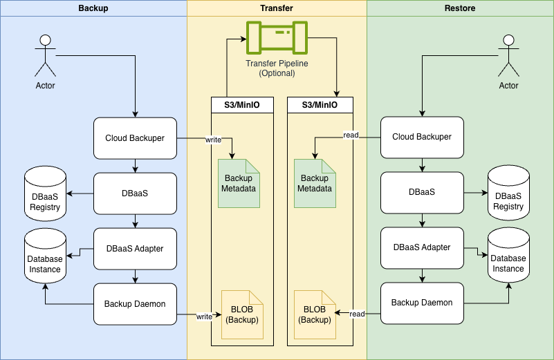

DBaaS Backup & Restore V2 process supports exporting Backup Metadata that describes the backup structure.

Using this Backup Metadata, logical databases can be restored in any DBaaS environment where the required adapters are available.

To transfer backup binaries and Backup Metadata across different environments, an S3-compatible shared object storage is required.

The backup process returns a unique `backup_id` (left side), which is then used to restore databases from that backup (right side).

## Open API

Open API: [`../OpenAPI.json`](../OpenAPI.json)

## Data Model

### Backup V2 Data Model

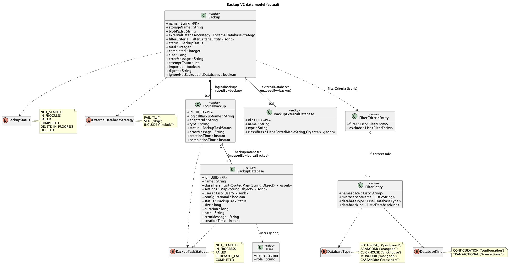

Source: [`../diagrams/backup-and-restore-v2/backup-v2-data-model.puml`](../diagrams/backup-and-restore-v2/backup-v2-data-model.puml)

#### Backup

Backup is the top-level backup operation entity that stores the requested filters and strategy plus the aggregated state of the backup (status, totals, size, errors) and links to all logical and external database backups.

| Field | Type | Description | Source |
|---|---|---|---|
| name | String | Unique name of the backup | BackupRequest.backupName |
| storageName | String | Name of the storage backend containing the backup | BackupRequest.storageName |
| blobPath | String | Path in the storage where backup will be stored | BackupRequest.blobPath |
| externalDatabaseStrategy | ExternalDatabaseStrategy | How to handle external databases during backup | BackupRequest.externalDatabaseStrategy |
| filterCriteria | FilterCriteriaEntity (jsonb) | Filter criteria | BackupRequest.filterCriteria |
| logicalBackups | List<LogicalBackup> | Collection of logical backups grouped by `adapterId`; each entry contains backup databases and tracks backup progress/status for that adapter group | - |
| externalDatabases | List<BackupExternalDatabase> | List of externally managed databases included in the backup according to external database strategy | - |
| status | BackupStatus | Current state of the backup operation | - |
| total | Integer | Total number of databases being backed up | - |
| completed | Integer | Number of databases with status `BackupTaskStatus.COMPLETED` | - |
| size | Long | Total size of the backup in bytes | - |
| errorMessage | String | Aggregated error details from failed logical backups | - |
| attemptCount | int | Number of tracking/aggregation attempts made for this backup (used by scheduler to limit retries) | - |
| imported | boolean | Indicates that backup metadata was imported from an external source rather than created by a local backup operation | - |
| digest | String | SHA-256 digest of backup metadata, used to verify integrity during upload/import | - |
| ignoreNotBackupableDatabases | boolean | Whether non-backupable databases were ignored during backup | BackupRequest.ignoreNotBackupableDatabases |

#### LogicalBackup

Databases that pass input filters and are identified as internal are grouped by `adapterId`; for each adapterId, a LogicalBackup is created.

| Field | Type | Description |
|---|---|---|
| id | UUID | Primary key generated in service via `UUID.randomUUID()` |
| logicalBackupName | String | Name of the logical backup in adapter |
| backup | Backup | Parent backup operation |
| adapterId | String | Unique identifier of the adapter |
| type | String | Type of the adapter |
| backupDatabases | List<BackupDatabase> | List of logical backup databases |
| status | BackupTaskStatus | Current state of backup databases of one adapter |
| errorMessage | String | Error message if backup failed |
| creationTime | Instant | Timestamp returned by adapter |
| completionTime | Instant | Timestamp returned by adapter |

#### BackupDatabase

Per-database backup record inside a LogicalBackup.

| Field | Type | Description |
|---|---|---|
| id | UUID | Primary key generated in service via `UUID.randomUUID()` |
| logicalBackup | LogicalBackup | Parent logical backup |
| name | String | Database name |
| classifiers | List<SortedMap<String,Object>> | List of database classifiers |
| settings | Map<String,Object> | Database settings |
| users | List<BackupDatabase.User> | List of database users |
| configurational | boolean | Indicates whether DB is configuration kind |
| status | BackupTaskStatus | Current state |
| size | long | Backup size |
| duration | long | Backup duration |
| path | String | Path to backup file in storage |
| errorMessage | String | Error message if backup failed |
| creationTime | Instant | Timestamp returned by adapter |

#### BackupExternalDatabase

External DB entries included in backup.

| Field | Type | Description |
|---|---|---|
| id | UUID | Primary key generated in service via `UUID.randomUUID()` |
| backup | Backup | Parent backup operation |
| name | String | External database name |
| type | String | Database type |
| classifiers | List<SortedMap<String,Object>> | List of database classifiers |

#### FilterCriteriaEntity

Filtering uses include (`filter`) and exclude (`exclude`) rules.

| Field | Type | Description |
|---|---|---|
| filter | List<FilterEntity> | Apply include filters |
| exclude | List<FilterEntity> | Exclude databases matching any filter |

#### FilterEntity

Single filter works as AND over filled fields.

| Field | Type | Description |
|---|---|---|
| namespace | List<String> | Filter by Kubernetes namespaces |
| microserviceName | List<String> | Filter by microservice names |
| databaseType | List<DatabaseType> | Filter by database types |
| databaseKind | List<DatabaseKind> | Filter by database kinds |

### Restore V2 Data Model

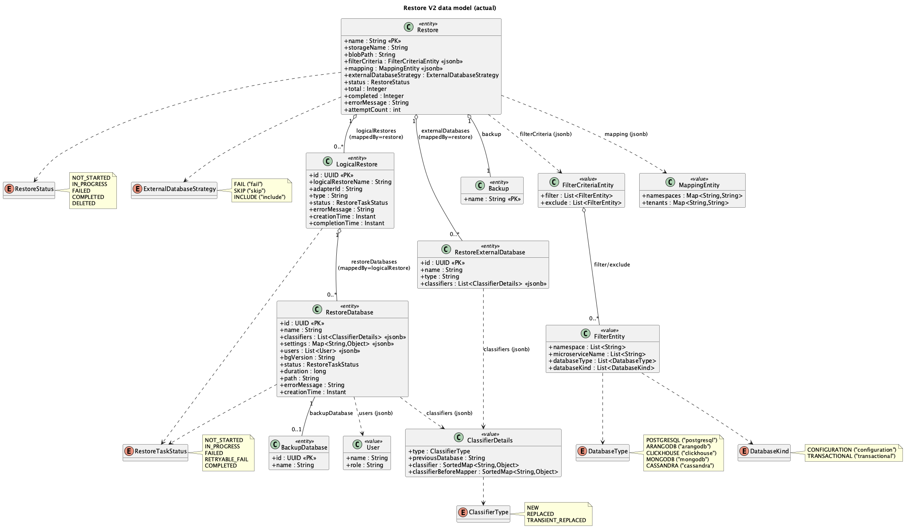

Source: [`../diagrams/backup-and-restore-v2/restore-v2-data-model.puml`](../diagrams/backup-and-restore-v2/restore-v2-data-model.puml)

#### Restore

Represents a restore operation created from a backup, including selected databases (logical and external), mapping/filtering applied, current status, and aggregated progress statistics.

| Field | Type | Description | Source |
|---|---|---|---|
| name | String | Unique name of the restore | RestoreRequest.restoreName |
| backup | Backup | Reference to parent backup entity (one-to-one relation) | - |
| storageName | String | Name of storage backend | RestoreRequest.storageName |
| blobPath | String | Path to restore file in storage | RestoreRequest.blobPath |
| filterCriteria | FilterCriteriaEntity (jsonb) | Filter criteria | RestoreRequest.filterCriteria |
| mapping | MappingEntity (jsonb) | Mapping to use for restore | RestoreRequest.mapping |
| logicalRestores | List<LogicalRestore> | List of logical restores | - |
| externalDatabaseStrategy | ExternalDatabaseStrategy | How to handle external DBs during restore | RestoreRequest.externalDatabaseStrategy |
| externalDatabases | List<RestoreExternalDatabase> | List of external databases | - |
| status | RestoreStatus | Current state of restore operation | - |
| total | Integer | Total number of databases being restored | - |
| completed | Integer | Number of databases with status `RestoreTaskStatus.COMPLETED` | - |
| errorMessage | String | Aggregated error messages during restore | - |
| attemptCount | int | Number of tracking/aggregation attempts made for this restore | - |

#### LogicalRestore

Per-adapter restore task within a restore operation.

| Field (LogicalRestore) | Type | Description |
|---|---|---|
| id | UUID | Primary key generated in service via `UUID.randomUUID()` |
| logicalRestoreName | String | Name/ID of logical restore in adapter |
| restore | Restore | Parent restore operation |
| adapterId | String | Unique identifier of adapter |
| type | String | Adapter type |
| restoreDatabases | List<RestoreDatabase> | List of logical restore databases |
| status | RestoreTaskStatus | Current state |
| errorMessage | String | Error message |
| creationTime | Instant | Timestamp returned by adapter for logical restore |
| completionTime | Instant | Timestamp returned by adapter for logical restore |

#### RestoreExternalDatabase

External database included in a restore operation.

| Field (RestoreExternalDatabase) | Type | Description |
|---|---|---|
| id | UUID | Primary key generated in service via `UUID.randomUUID()` |
| restore | Restore | Parent restore operation |
| name | String | External database name |
| type | String | Database type |
| classifiers | List<ClassifierDetails> | Classifier objects describing database attributes |

#### RestoreDatabase

Single database being restored inside logical restore.

| Field | Type | Description |
|---|---|---|
| id | UUID | Primary key generated in service via `UUID.randomUUID()` |
| logicalRestore | LogicalRestore | Parent logical restore |
| backupDatabase | BackupDatabase | Source backup database |
| name | String | Database name |
| classifiers | List<ClassifierDetails> | Classifier details; sorted map is in `classifier` field |
| settings | Map<String,Object> | Database settings |
| users | List<RestoreDatabase.User> | List of database users |
| bgVersion | String | Blue-Green version of database |
| status | RestoreTaskStatus | Current state |
| duration | long | Duration of restore operation |
| path | String | Path to restore file in storage |
| errorMessage | String | Error message |
| creationTime | Instant | Timestamp returned by adapter for restore database |

#### MappingEntity

Namespace/tenant mapping used during restore initialization.

| Field | Type | Description |
|---|---|---|
| namespaces | Map<String,String> | Source namespace -> target namespace |
| tenants | Map<String,String> | Source tenant -> target tenant |

#### ClassifierDetails

Classifier details used to identify logical DB and mapping behavior.

| Field | Type | Description |
|---|---|---|
| type | ClassifierType | NEW / REPLACED / TRANSIENT_REPLACED |
| previousDatabase | String | Previously associated database name |
| classifier | SortedMap<String,Object> | Current classifier key-value map |
| classifierBeforeMapper | SortedMap<String,Object> | Original classifier before mapping |

## Sequence Diagrams

### Start Backup

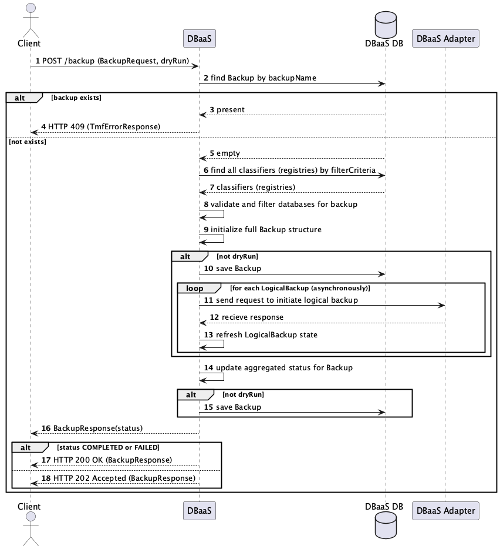

Source: [`../diagrams/backup-and-restore-v2/start-backup-sequence.puml`](../diagrams/backup-and-restore-v2/start-backup-sequence.puml)

### Check Backup Async

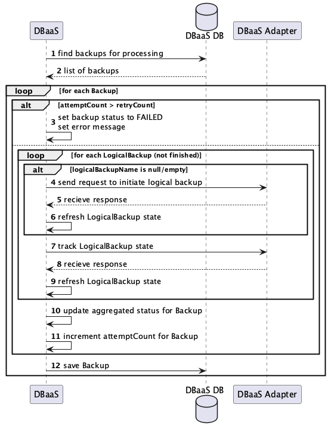

Source: [`../diagrams/backup-and-restore-v2/check-backup-async-sequence.puml`](../diagrams/backup-and-restore-v2/check-backup-async-sequence.puml)

### Start Restore

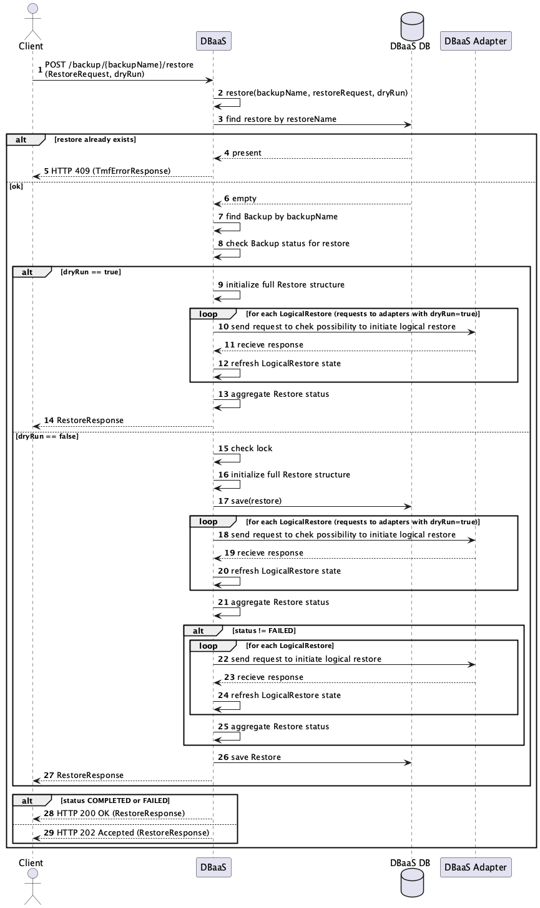

Source: [`../diagrams/backup-and-restore-v2/start-restore-sequence.puml`](../diagrams/backup-and-restore-v2/start-restore-sequence.puml)

### Check Restore Async

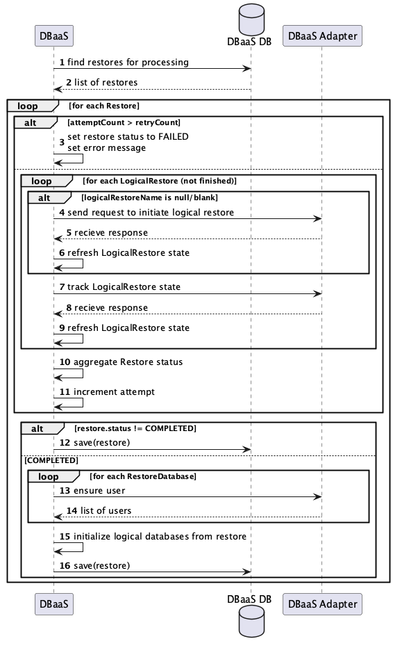

Source: [`../diagrams/backup-and-restore-v2/check-restore-async-sequence.puml`](../diagrams/backup-and-restore-v2/check-restore-async-sequence.puml)

### Retry Restore

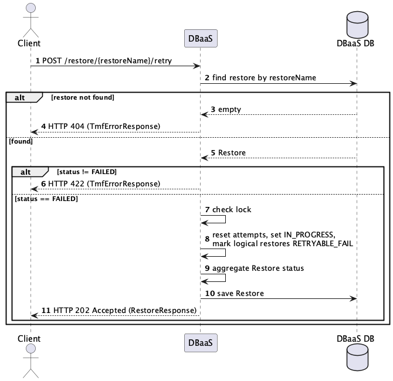

Source: [`../diagrams/backup-and-restore-v2/retry-restore-sequence.puml`](../diagrams/backup-and-restore-v2/retry-restore-sequence.puml)

### Get Backup Metadata

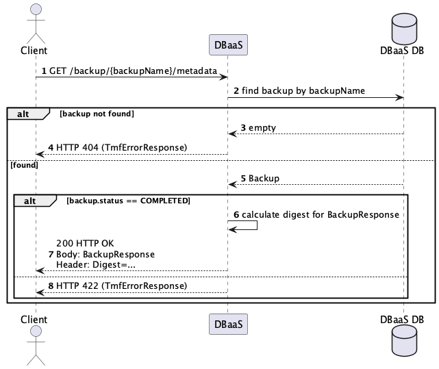

Source: [`../diagrams/backup-and-restore-v2/get-backup-metadata-sequence.puml`](../diagrams/backup-and-restore-v2/get-backup-metadata-sequence.puml)

### Upload Backup Metadata

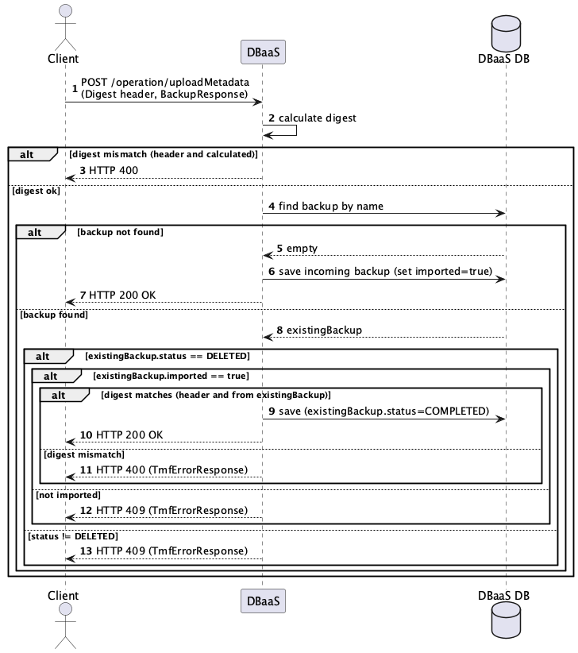

Source: [`../diagrams/backup-and-restore-v2/upload-backup-metadata-sequence.puml`](../diagrams/backup-and-restore-v2/upload-backup-metadata-sequence.puml)

### Delete Backup

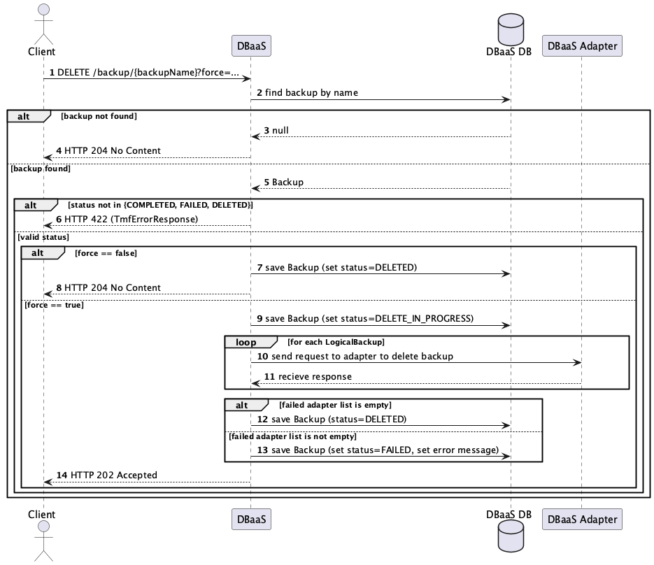

Source: [`../diagrams/backup-and-restore-v2/delete-backup-sequence.puml`](../diagrams/backup-and-restore-v2/delete-backup-sequence.puml)

## State Diagrams

### Backup

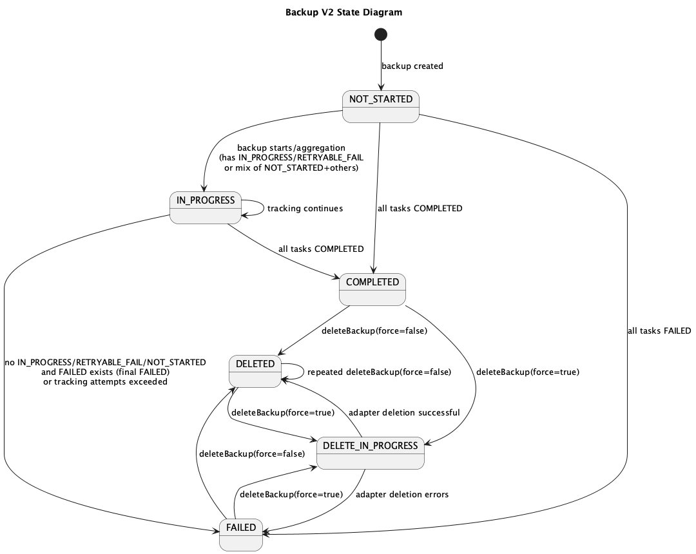

Source: [`../diagrams/backup-and-restore-v2/backup-v2-state.puml`](../diagrams/backup-and-restore-v2/backup-v2-state.puml)

### Restore

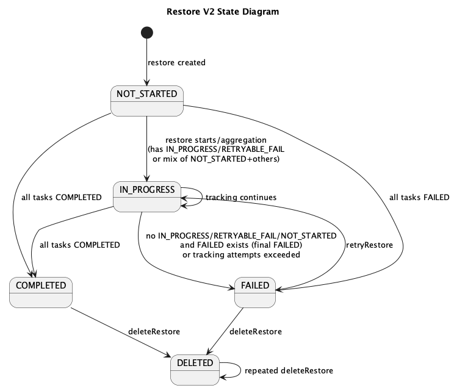

Source: [`../diagrams/backup-and-restore-v2/restore-v2-state.puml`](../diagrams/backup-and-restore-v2/restore-v2-state.puml)

## Configuration Parameters

| Parameter | Environment Variable | Default Value | Description |
|---|---|---|---|
| `dbaas.backup-restore.check.interval` | `DBAAS_BACKUP_RESTORE_CHECK_INTERVAL` | `1m` | Interval for periodic backup/restore status checks. |
| `dbaas.backup-restore.check.attempts` | `DBAAS_BACKUP_RESTORE_CHECK_ATTEMPTS` | `20` | Max number of tracking attempts before marking backup/restore as `FAILED`. |
| `dbaas.backup-restore.retry.delay.seconds` | `DBAAS_BACKUP_RESTORE_RETRY_DELAY_SECONDS` | `3` | Delay between adapter retry attempts. |
| `dbaas.backup-restore.retry.attempts` | `DBAAS_BACKUP_RESTORE_RETRY_ATTEMPTS` | `3` | Max number of adapter retry attempts. |
| `backup.aggregator.async.thread.pool.size` | `BACKUP_AGGREGATOR_ASYNC_THREAD_POOL_SIZE` | `10` | Thread pool size for async backup/restore operations. |
| `shedlock.defaults.lock-at-most-for` | `DBAAS_BACKUP_RESTORE_CHECK_LOCK_TIMEOUT` | `PT10M` | Max lock holding time for schedulers. |
