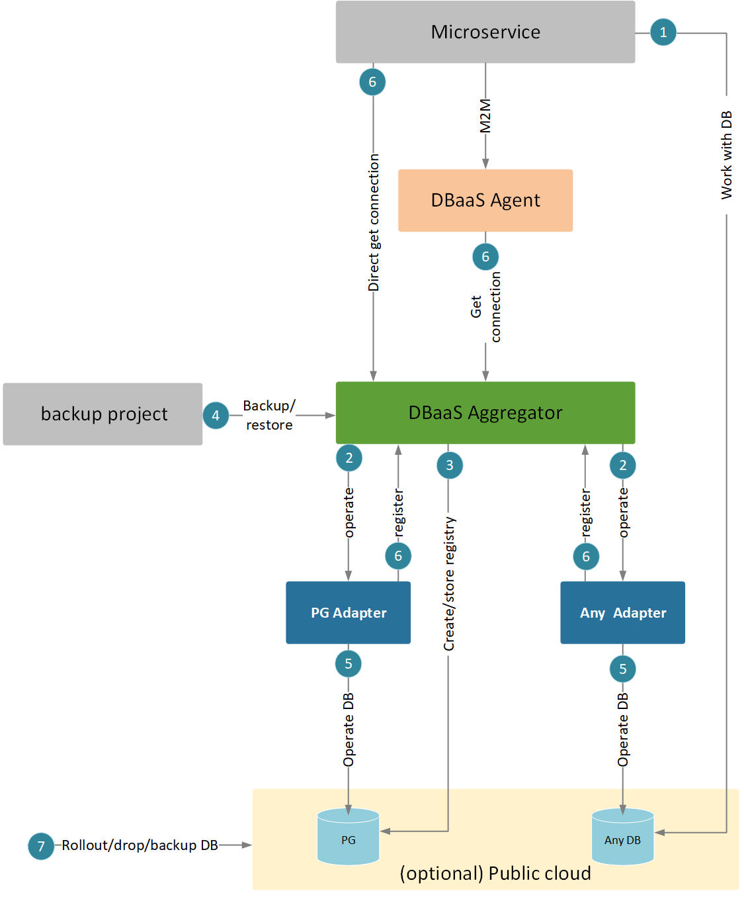

There are many different credentials used in the different situations that you may need to rotate.

On the following picture every number is a different credential.

- [1. Microservice -> DB](#1-microservice---db)
- [2. DBaaS Aggregator -> DBaaS Adapter](#2-dbaas-aggregator---dbaas-adapter)
- [3. DBaaS Aggregator -> PG](#3-dbaas-aggregator---pg)
- [4. Backup application -> DBaaS Aggregator](#4-backup-application---dbaas-aggregator)
- [5. DBaaS Adapter -> DB](#5-dbaas-adapter---db)
- [6. DBaaS Adapter -> DBaaS Aggregator](#6-dbaas-adapter---dbaas-aggregator)
- [7. Public clouds](#7-public-clouds)

# 1. Microservice -> DB

## Role

Microservice connects to DB using these credentials, previously obtained from DBaaS Aggregator or DBaaS Agent.
Typically several credentials for one DB could exist at a time - several users with different roles.

## Credentials storage

#### In microservice

Value should be stored in memory only and obtained every time from DBaaS Aggregator / DBaaS Agent.
In some cases credentials are stored in Kubernetes secret.

#### In DBaaS Aggregator

Is stored in internal registry DB.

## Rotation guide

The existing guides cover only cases when client uses DBaaS Aggregator / DBaaS Agent to obtain credentials and doesn't
store them in any persistent storage.

[Change passwords of logical databases](../rest-api.md#change-user-password)

Please note that you need to invoke the password-changing API for each type of database.

## Action to update password

Restart microservice.

# 2. DBaaS Aggregator -> DBaaS Adapter

## Role

DBaaS Aggregator uses these credentials to work with DBaaS Adapters (create DB, create user etc.).

## Credentials storage

Credentials are specified for DBaaS Adapter during installation and are propagated to DBaaS Aggregator during DBaaS
Adapter autodiscovery (registration), so they are not stored in DBaaS Aggregator env variables.

#### In parameters registry

Each physical database has its own parameter naming, so please refer to specific physical DB documentation.

#### In DBaaS Adapter

Kubernetes secrets. Different physical databases have different secret name.

## Rotation guide

Go to parameters registry of the physical database and modify the required parameters. Please refer to the documentation
of specific physical DB for details.

## Action to update password

1) Redeploy the physical database in update mode;
2) Restart DBaaS Adapter pod in order to attach a new credentials.

# 3. DBaaS Aggregator -> PG

## Role

DBaaS Aggregator has its own registry DB in PostgreSQL instance, and it should either be able to create this DB (DBA
credentials) or such DB should be provided (DB credentials).

## Credentials storage

#### When DBA could be provided

In DBaaS Aggregator parameters registry: `POSTGRES_DBA_USER` / `POSTGRES_DBA_PASSWORD`

In PostgreSQL:

- Username: `postgres` (hardcoded)
- Password: in Helm `values.yaml`.

In this case, DBaaS Aggregator's Validation Image will use DBA user and create a new user and empty database for DBaaS
Aggregator. These user and DB name can be random or can have value from `POSTGRES_DBAAS_DATABASE_NAME` /
`POSTGRES_DBAAS_USER` / `POSTGRES_DBAAS_PASSWORD` parameters if they are passed.

After the first DBaaS Aggregator installation DBA credentials `POSTGRES_DBA_USER` / `POSTGRES_DBA_PASSWORD` are no
longer
needed.

#### When DBA could not be provided

You can pre-create DB and user and pass them via parameters registry:

`POSTGRES_DBAAS_DATABASE_NAME` / `POSTGRES_DBAAS_USER` / `POSTGRES_DBAAS_PASSWORD`

with `DBAAS_OWN_PG_DB_CREATED_MANUALLY` = `true`

Credentials are stored in a Kubernetes secret: `dbaas-storage-credentials`.

## Rotation guide

1) Go to `dbaas-storage-credentials` and find registry DB username;
2) Go to DBaaS Aggregator environment variables and find `POSTGRES_HOST`;
3) Go to PG master node by address from `POSTGRES_HOST`;
4) Using the pod terminal, execute the `psql` command to access the PostgreSQL terminal with administrative privileges;
5) Change password of the user with username from the first step: 
   `ALTER USER <current name of dbaas pg user> WITH PASSWORD 'new_password';`;
6) Access the `dbaas-storage-credentials` secret once more, then make edits to this secret and update the password
   with a new one;
7) Save secret and redeploy DBaaS Aggregator;
8) To ensure configuration integrity, if you are utilizing the `POSTGRES_DBAAS_PASSWORD` parameter, then update this
   parameter with a new password.

## Action to update password

1) Redeploy DBaaS Aggregator to use new password value from secret;
2) Restart DBaaS Aggregator pod if it was not restarted during redeploy.

# 4. Backup application -> DBaaS Aggregator

## Role

<u>This step is relevant only if you are utilizing the DBaaS backup/restore capabilities</u>

Credentials used by some application to perform backup of application databases.

## Credentials storage

#### In DBaaS Aggregator

`BACKUP_DAEMON_DBAAS_ACCESS_USERNAME` / `BACKUP_DAEMON_DBAAS_ACCESS_PASSWORD`

#### In backup application

`BACKUP_DAEMON_DBAAS_ACCESS_USERNAME` / `BACKUP_DAEMON_DBAAS_ACCESS_PASSWORD`

## Rotation guide

1) Go to DBaaS Aggregator parameters registry and add or modify these parameters: 
   `BACKUP_DAEMON_DBAAS_ACCESS_USERNAME` / `BACKUP_DAEMON_DBAAS_ACCESS_PASSWORD`;
2) Redeploy DBaaS Aggregator in update mode with updated credentials;
3) Go to backup application parameters registry and add or modify these parameters: 
   `BACKUP_DAEMON_DBAAS_ACCESS_USERNAME` / `BACKUP_DAEMON_DBAAS_ACCESS_PASSWORD`;
4) Redeploy backup application in update mode with updated credentials.

## Action to update password

1) Redeploy DBaaS Aggregator and backup application in update mode;
2) Restart DBaaS Aggregator pod if it was not restarted during redeploy.

# 5. DBaaS Adapter -> DB

## Role

User credentials of DBaaS Adapter that is used by him to perform administrative operations - create DB, create users
etc.

## Credentials storage

#### In parameters registry

Each physical database has its own parameter naming, so please refer to specific physical DB documentation.

#### In DBaaS Adapter

Kubernetes secrets. Different physical databases have different secret name.

## Rotation guide

Different databases have different methods to change password with which DBaaS Adapter operates with physical database.
To find out how to execute password changes at this level, please reach out to the respective team for guidance.

After the password changed in physical database, go to the related parameters registry and modify or add required
configuration parameters.

## Action to update password

1) Change the password in physical database;
2) Redeploy the physical database in update mode;
3) Restart DBaaS Adapter pod, if it was not restarted during redeploy, in order to attach the new credentials.

# 6. DBaaS Adapter -> DBaaS Aggregator

## Role

Main credentials to access the DBaaS Aggregator API. Is rarely used directly, but some scenarios exist:

- Access from DBaaS Agent: microservice calls DBaaS Agent to get DB connection string, then DBaaS Agent calls DBaaS
  Aggregator via these credentials;
- Direct access from microservices to DBaaS Aggregator without DBaaS Agent;
- DBaaS Adapters autodiscovery: DBaaS Adapter calls DBaaS Aggregator to register itself.

## Credentials storage

#### In DBaaS Aggregator

`DBAAS_CLUSTER_DBA_CREDENTIALS_USERNAME` / `DBAAS_CLUSTER_DBA_CREDENTIALS_PASSWORD` - main API credentials for most of
the existing endpoints.

`DBAAS_DB_EDITOR_CREDENTIALS_USERNAME` / `DBAAS_DB_EDITOR_CREDENTIALS_PASSWORD` – these grants are needed for DBA person
to manually call APIs from DBaaS Aggregator.

`DBAAS_TENANT_USERNAME` / `DBAAS_TENANT_PASSWORD` – are needed to Tenant Manager microservice in Cloud Core project.

`DISCR_TOOL_USER_USERNAME` / `DISCR_TOOL_USER_PASSWORD` – dedicated grants for discrepancy tool application.

#### In DBaaS Adapters

In parameters registry according to the specific physical DB documentation.

In Kubernetes these credentials are stored in secrets.

#### In DBaaS Agent

`DBAAS_CLUSTER_DBA_CREDENTIALS_USERNAME` / `DBAAS_CLUSTER_DBA_CREDENTIALS_PASSWORD`

These parameters are passed to DBaaS Agent via secret, not as a direct Env variables.

## Rotation guide

1) Go to DBaaS Aggregator parameters registry and add or modify these parameters: 
   `DBAAS_CLUSTER_DBA_CREDENTIALS_USERNAME` / `DBAAS_CLUSTER_DBA_CREDENTIALS_PASSWORD` 
   `DBAAS_DB_EDITOR_CREDENTIALS_USERNAME` / `DBAAS_DB_EDITOR_CREDENTIALS_PASSWORD` 
   `DBAAS_TENANT_USERNAME` / `DBAAS_TENANT_PASSWORD` 
   `DISCR_TOOL_USER_USERNAME` / `DISCR_TOOL_USER_PASSWORD`.
2) Redeploy DBaaS Aggregator in update mode with updated credentials.
3) Restart DBaaS Aggregator pod if it was not restarted during redeploy.
4) Go to each physical database parameters registry and add or modify parameters according to the
   specific physical DB documentation. The username and password must match `DBAAS_CLUSTER_DBA_CREDENTIALS_USERNAME` /
   `DBAAS_CLUSTER_DBA_CREDENTIALS_PASSWORD` from the first step. Please take note that you need to update all physical
   databases used in the DBaaS Aggregator. List of all registered physical databases can be obtained by
   this [API](../rest-api.md#list-registered-physical-databases) (type must be `all`).
5) Redeploy physical databases with updated parameters.
6) Call DBaaS Aggregator health API. Go to pod terminal and run curl `localhost:8080/health`. Status must be `UP`.
7) Go to parameters registry for each project utilizing Cloud Core that also uses the DBaaS Aggregator password you are
   modifying, add or modify the same parameters as in step 1).
8) Redeploy the projects whose configurations were modified in the step 7), using the update mode.
9) Restart DBaaS Agent pod.

## Action to update password

Redeploy:

- DBaaS Aggregator;
- All physical databases used by DBaaS Aggregator;
- Cloud Core based projects that used DBaaS Aggregator password which you are changing.

# 7. Public clouds

In public clouds (Google, Azure, AWS) - managed DB instance creation / deletion / backup requires special credentials of
public cloud itself.
